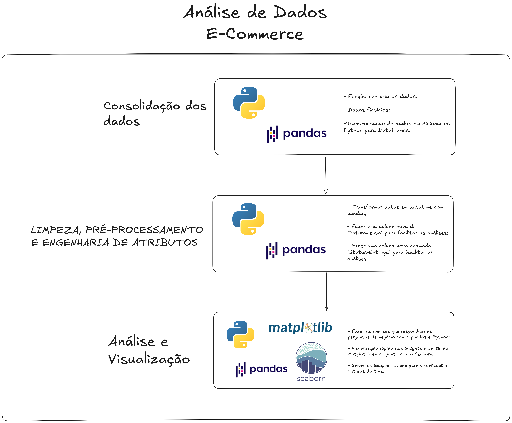
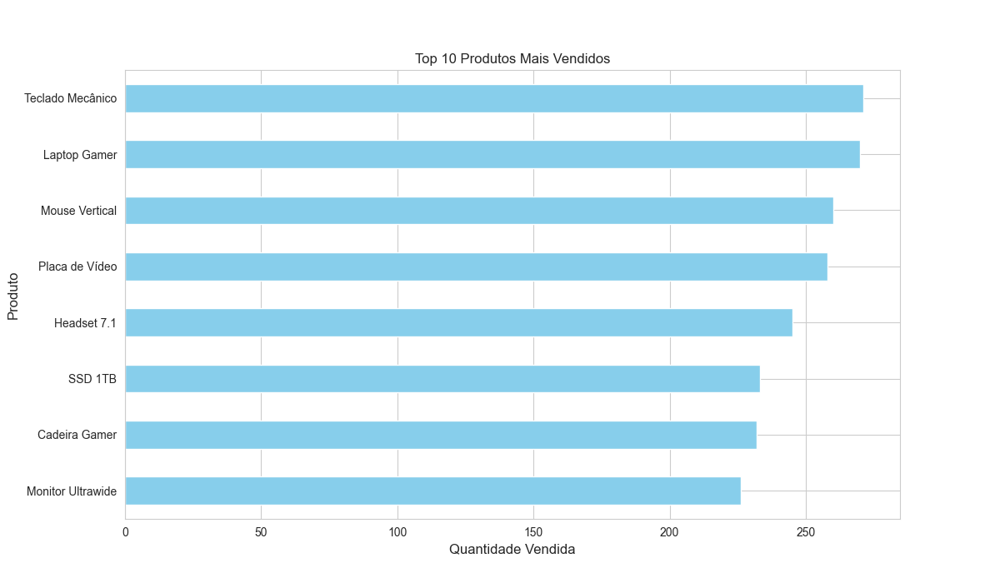
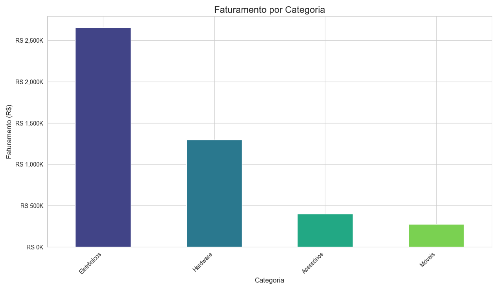
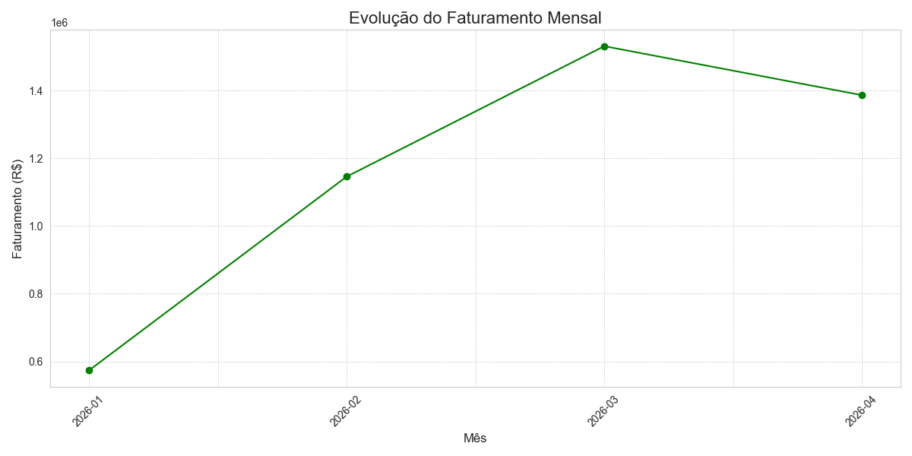
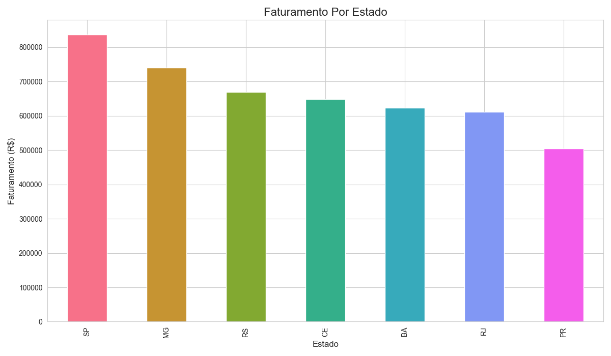

# 🛒 Análise de Dados para E-commerce


---

## 📌 Visão Geral do Projeto
Projeto de **Análise de Dados** voltado para um **e-commerce** que precisa tomar **decisões baseadas em dados**. Esse tipo de demanda é o alicerce da área de dados, pois conecta conhecimentos teóricos e práticos para gerar **valor real para o negócio**.

Atualmente, apenas escrever código não é suficiente: resolver **problemas reais de negócio** é essencial — e tudo começa com um **problema bem definido**.

---

## 🏪 Problema de Negócio
Nossa loja de e-commerce está em fase de crescimento, registrando um volume cada vez maior de transações diárias. No entanto, essa grande quantidade de dados de vendas, em seu estado bruto, é como um **baú de tesouro trancado**: sabemos que há valor ali, mas não conseguimos acessá-lo.

Hoje, muitas decisões estratégicas são tomadas com base em **intuição e observações parciais**, o que gera os seguintes desafios:

- **Gestão de Estoque Ineficiente**  
  Falta de clareza sobre produtos com alta e baixa rotatividade, resultando em excesso de estoque ou ruptura de itens importantes.

- **Marketing com Baixo Retorno**  
  Campanhas genéricas por não saber quais categorias e regiões concentram maior faturamento.

- **Perda de Oportunidades Sazonais**  
  Dificuldade em identificar padrões e tendências de vendas ao longo do tempo.

- **Expansão sem Direção**  
  Falta de visibilidade sobre quais regiões são mais promissoras para expansão e logística.

🔎 **Problema central:** falta de visibilidade clara sobre a performance do negócio, impedindo decisões rápidas, inteligentes e baseadas em evidências.

---

## 🎯 Objetivos de Negócio
Este projeto tem como objetivo transformar **dados brutos de vendas** em **insights acionáveis**, respondendo às seguintes perguntas fundamentais:

- **O que vender?**  
  Identificar os produtos de maior sucesso para otimizar portfólio e estoque.

- **Onde focar?**  
  Descobrir quais categorias geram a maior parte da receita.

- **Quando agir?**  
  Analisar a performance ao longo do tempo para identificar tendências e sazonalidades.

- **Para onde expandir?**  
  Mapear a distribuição geográfica das vendas para identificar mercados estratégicos.

---

## 🧠 Solução Técnica
Mesmo em projetos simples, aplicar um **fluxo estruturado de dados** é um dos fundamentos da **Engenharia de Dados**. A solução adotada seguiu as etapas abaixo:

1. **Consolidação dos dados**  
   Os dados foram **gerados de forma fictícia** para fins de estudo.

2. **Limpeza e preparação**  
   Análise da estrutura inicial e aplicação de conceitos de **engenharia de atributos**, tornando informações implícitas em dados explícitos.

3. **Análise orientada ao negócio**  
   Exploração dos dados com foco direto em responder às perguntas de negócio definidas.

Ao final, foram criadas **visualizações simples e objetivas**, permitindo que gestores e líderes tenham uma **visão rápida e clara** sobre produtos, vendas e faturamento.

---

## 🔄 Fluxo da Solução



---

## 📊 Perguntas Respondidas pela Análise
Os resultados da análise permitiram gerar os seguintes insights de negócio:

- **Otimização de Estoque**  
  Identificação dos produtos mais e menos vendidos, reduzindo custos e evitando perdas.



- **Marketing Direcionado e Eficaz**  
  Segmentação por categorias e regiões mais lucrativas, aumentando o **ROI**.



- **Planejamento Estratégico**  
  Análise de tendências mensais para antecipar períodos de alta e baixa demanda.



- **Direcionamento para onde expandir**  
  Identificação de regiões de alta demanda para direcionar uma expansão conciente.



---

## 🚀 Como Utilizar a Solução

### 🔧 Pré-requisitos
Recomenda-se a criação de um **ambiente virtual**, garantindo isolamento e organização do projeto:

```bash
conda create --name nome_do_ambiente 
```

Caso não tenha o Anaconda instalado, faça o download gratuito em:
https://www.anaconda.com/download

### 📥 Instalação

Clone o repositório:

````
git clone <URL_HTTPS_DO_REPOSITORIO>
````

Acesse a pasta do projeto:

````
cd mini_projeto1
````

Instale as dependências:

````
pip install -r requirements.txt`
````

### ▶️ Execução
Execute o script principal:

````
python analise_vendas.py
````

### ⚠️ Observações
Esta análise é válida para a modelagem de dados utilizada no DataFrame do projeto.

Para aplicar a solução em um cenário real, serão necessárias adaptações nos dados e regras de negócio.

---

## 🛠️ Tecnologias Utilizadas

- Python

- Pandas

- NumPy

- Matplotlib

- Seaborn

---

## 🙌 Agradecimentos
Agradeço à **Data Science Academy (DSA)** por disponibilizar um curso gratuito de alta qualidade, que serviu como base para os estudos e projetos presentes neste repositório.